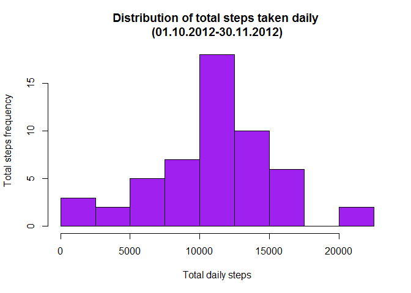
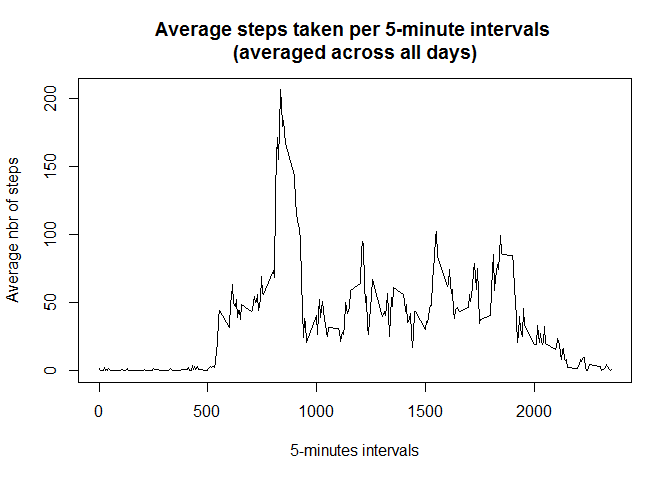
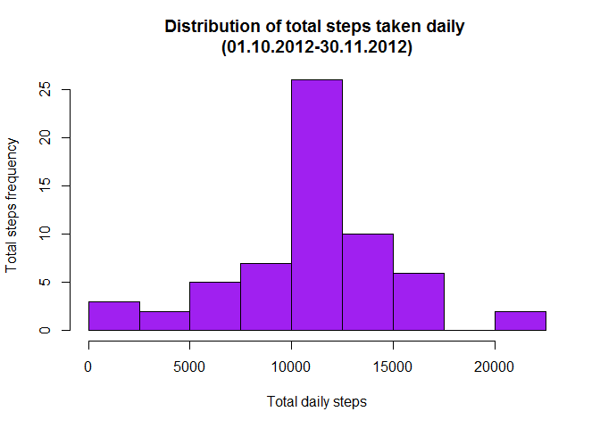
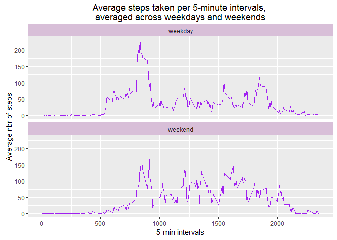

# Reproducible Research: Peer Assessment 1
Minna Toorikka  


```r
##Change figures' output folder manually, because knitr created a different folder structure by default
knitr::opts_chunk$set(fig.path='figure/PA1-')
```

## 1. Loading and preprocessing the data


```r
listZip <- unzip("./Activity.zip")
activity <- read.csv("activity.csv", header=TRUE, sep=",", na.strings="NA")

library(ggplot2)

##pre-calcuate total steps per day (61 days), you can ignore the NAs  
##(There are 8 full days without any data (not even zeros))

totalDailySteps <- aggregate(activity$steps, by=list(date=activity$date), FUN=sum)
colnames(totalDailySteps)[2] <- "total_steps" 


##pre-calculate average steps per 5-min interval (288 intervals)

avgIntSteps <- aggregate(activity$steps, by=list(interval=activity$interval), FUN=mean, na.action=na.pass, na.rm=TRUE)         ##na.pass= not to delete NA rows, na.rm= mean() function to ignore them 
colnames(avgIntSteps)[2] <- "avg_steps"
```


##What is mean total number of steps taken per day?  


##2. Make a histogram of the total number of steps taken each day (NAs unhandled)

```r
  ##distribute steps in smaller bins for clarity
bins <- c(0, 2500, 5000, 7500, 10000, 12500, 15000, 17500, 20000, 22500) 
```


```r
par(mfrow = c(1,1))
hist(totalDailySteps$total_steps, 
     breaks=bins, xlim=c(0,22500), col="purple",
     xlab="Total daily steps", 
     ylab="Total steps frequency", 
     main="Distribution of total steps taken daily \n(01.10.2012-30.11.2012)")
```



We can see from the histogram of this dataset that the Mean and probably also Median of the daily steps is somewhere between 10000 and 12500 steps/day (i.e. the middle bin). Let's check the values with the simple summary function of the currrent data:

##3. Calculate the mean and median of the daily total steps


```r
summary(totalDailySteps)
```

```
##          date     total_steps   
##  2012-10-01: 1   Min.   :   41  
##  2012-10-02: 1   1st Qu.: 8841  
##  2012-10-03: 1   Median :10765  
##  2012-10-04: 1   Mean   :10766  
##  2012-10-05: 1   3rd Qu.:13294  
##  2012-10-06: 1   Max.   :21194  
##  (Other)   :55   NA's   :8
```

Mean = 10766  
Median = 10765


## 4. What is the average daily activity pattern?

Plot the average number of steps taken, averaged across all days, to see the steps taken in different 5-minute intervals.


```r
plot(avgIntSteps$interval, avgIntSteps$avg_steps, type="l", 
     xlab="5-minutes intervals",
     ylab="Average nbr of steps",
     main="Average steps taken per 5-minute intervals \n(averaged across all days)")
```



##5. Identify the 5-minute interval which has the maximum average step amount 


```r
max <- avgIntSteps[which.max(avgIntSteps$avg_steps == max(avgIntSteps$avg_steps)), ] ##(taking possible ties into account, too).

max
```

```
##     interval avg_steps
## 104      835  206.1698
```

The interval with biggest amount of steps is 835.

## 6. Imputing missing values

Calculate and report the total number of missing values in the dataset:


```r
summary(activity)
```

```
##      steps                date          interval     
##  Min.   :  0.00   2012-10-01:  288   Min.   :   0.0  
##  1st Qu.:  0.00   2012-10-02:  288   1st Qu.: 588.8  
##  Median :  0.00   2012-10-03:  288   Median :1177.5  
##  Mean   : 37.38   2012-10-04:  288   Mean   :1177.5  
##  3rd Qu.: 12.00   2012-10-05:  288   3rd Qu.:1766.2  
##  Max.   :806.00   2012-10-06:  288   Max.   :2355.0  
##  NA's   :2304     (Other)   :15840
```

There are 2304 missing values (NAs) in the variable 'steps'.


```r
##copy activity raw data to a new df to keep the original data intact
fullactivity <- activity
```

Imputing strategy:
Since the 5-min interval avg steps data frame has all data (no NAs), we use it as the source for filling up the missing values in the `fullactivity` data frame.
We search the NAs from the destination data frame, compare the interval in both data frames and fill the gaps with the `avg_steps` data from `avgIntSteps` for each matching interval that has a missing value.


```r
fullactivity$steps[is.na(fullactivity$steps)] <- 
    avgIntSteps$avg_steps[match(fullactivity$interval[is.na(fullactivity$steps)],     avgIntSteps$interval)]
```


Check that there are no longer NAs in the new data set.


```r
summary(fullactivity)
```

```
##      steps                date          interval     
##  Min.   :  0.00   2012-10-01:  288   Min.   :   0.0  
##  1st Qu.:  0.00   2012-10-02:  288   1st Qu.: 588.8  
##  Median :  0.00   2012-10-03:  288   Median :1177.5  
##  Mean   : 37.38   2012-10-04:  288   Mean   :1177.5  
##  3rd Qu.: 27.00   2012-10-05:  288   3rd Qu.:1766.2  
##  Max.   :806.00   2012-10-06:  288   Max.   :2355.0  
##                   (Other)   :15840
```

##7. Create a histogram of the total number of steps taken each day after missing values are imputed


```r
imputedDailySteps <- aggregate(fullactivity$steps, by=list(date=fullactivity$date), FUN=sum)
colnames(imputedDailySteps)[2] <- "total_steps"
```


```r
hist(imputedDailySteps$total_steps, 
     breaks=bins, xlim=c(0,22500), col="purple",
     xlab="Total daily steps", 
     ylab="Total steps frequency", 
     main="Distribution of total steps taken daily \n(01.10.2012-30.11.2012)")
```




Check the Mean and Median again with the new dataset.


```r
summary(imputedDailySteps)
```

```
##          date     total_steps   
##  2012-10-01: 1   Min.   :   41  
##  2012-10-02: 1   1st Qu.: 9819  
##  2012-10-03: 1   Median :10766  
##  2012-10-04: 1   Mean   :10766  
##  2012-10-05: 1   3rd Qu.:12811  
##  2012-10-06: 1   Max.   :21194  
##  (Other)   :55
```

After adding the avg step values for empty days/intervals, the steps frequency in the middle area has obviously grown, but otherwise the graph & steps' overall distribution looks quite similar. 
Based on summary, there is no difference in the Mean value and a small difference in the Median (10765 vs 10766) after the NAs were replaced with avg/mean step values.   (Had we used some other method to handle the NAs in the datasets, the values might look different.)


## Are there differences in activity patterns between weekdays and weekends?

Create a new factor variable in the dataset with two levels - "weekday" and "weekend" indicating whether a given date is a weekday or weekend day.


```r
fullactivity$wday <- weekdays(as.Date(as.character(fullactivity$date), format="%Y-%m-%d"))
fullactivity$wday <- as.factor(ifelse(fullactivity$wday %in% c("lauantai", "Saturday", "sunnuntai", "Sunday"), "weekend", "weekday"))
##note, my R environment has Finnish time env settings, hence also Finnish days
```

##8. Make a panel plot containing a time series plot of the 5-minute interval (x-axis) and the average number of steps taken, averaged across all weekday days or weekend days (y-axis). 


```r
avgFullSteps <- aggregate(fullactivity$steps, by=list(wday=fullactivity$wday, interval=fullactivity$interval), FUN=mean)
colnames(avgFullSteps)[3] <- "avg_steps"
```


```r
ggplot(avgFullSteps, aes(x=interval, y=avg_steps) ) + 
  geom_line(col="purple") + facet_wrap( ~ wday, ncol=1 ) + 
  theme(strip.background = element_rect(fill="thistle"))+
  labs(list(x = "5-min intervals", y = "Average nbr of steps")) +
  ggtitle("Average steps taken per 5-minute intervals, \naveraged across weekdays and weekends") +
  theme(plot.title = element_text(hjust = 0.5))
```



Looks like on weekdays there is an activity burst in the morning (whey people wake up and get ready for work) but then people presumably sit more at their office desk. People also wake up earlier on weekdays (more steps in the early morning) and are less active in the evenings. On weekends, people are more active thoughout the day, also in the evening.
